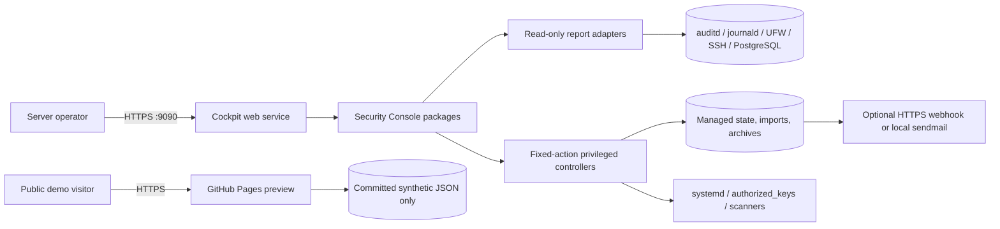
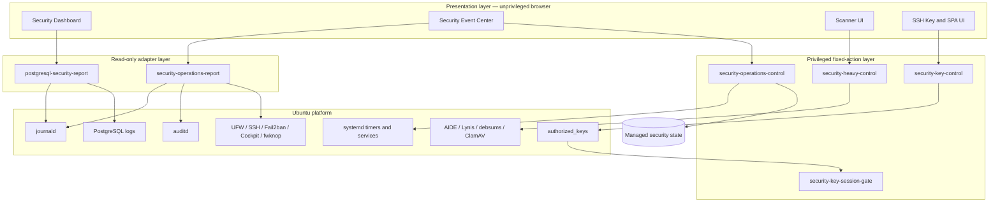
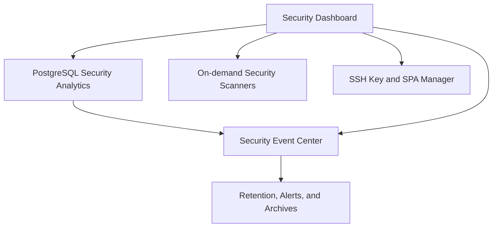

# Architecture

## 1. Document purpose

This document defines the engineering architecture of Ubuntu Personal Server Security Console. It describes system boundaries, runtime components, data flows, privilege separation, deployment topology, reliability expectations, and the controls used to prevent public demo or build artifacts from crossing into production data paths.

The intended audience is maintainers, security reviewers, package engineers, and operators evaluating the system before deployment.

## 2. Architectural goals

The project is designed around the following goals:

1. **Local-first operation.** Security telemetry remains on the managed Ubuntu host unless an operator explicitly enables summary-only notification delivery.
2. **Low operational overhead.** The console uses existing host services and bounded report processes instead of adding a database, message broker, or resident analytics cluster.
3. **Explicit privilege boundaries.** Read-only collection and privileged mutation are separate programs. Privileged programs expose enumerated actions rather than arbitrary command execution.
4. **Modular deployment.** Operators select only the capabilities required by the host. The installer calculates transitive dependencies and asks before installing system packages.
5. **Evidence preservation.** Imported logs, review records, and archives use restrictive permissions, atomic state writes, SHA-256 metadata, and conservative uninstall behavior.
6. **Degraded-mode visibility.** Missing optional sources produce health information rather than making the entire interface unavailable.
7. **Safe public demonstration.** The GitHub Pages preview is isolated from all production code paths and reads only a committed, deterministic synthetic dataset.

## 3. Non-goals

- It is not a multi-tenant SIEM or a replacement for centralized enterprise log management.
- It does not claim tamper resistance against a fully compromised root account.
- It does not expose arbitrary shell execution from the browser.
- It does not upload raw logs to the public preview, GitHub, webhooks, or email recipients.
- It does not automatically enable high-resource scanners during package installation.

## 4. System context



The production console executes inside Cockpit's authenticated host session. GitHub Pages is a separate static deployment and has no route, credential, token, or API endpoint connected to the Ubuntu host.

## 5. Logical architecture

The production system follows a presentation–adapter–controller architecture.



### 5.1 Presentation layer

Cockpit packages under `/usr/share/cockpit/` provide HTML, CSS, and JavaScript. They render reports, validate user input before submission, and call only known local executables through Cockpit. The browser does not directly read privileged files.

### 5.2 Read-only adapter layer

Report adapters normalize heterogeneous host sources into versioned JSON documents:

- `postgresql-security-report` reads PostgreSQL journal and supported text, CSV, JSON, JSONL, and gzip log formats. It calculates authentication counts, hourly errors per minute, FATAL records, and failed-login rankings.
- `security-operations-report` reads known audit and service sources, redacts secret-shaped fields, incorporates integrity-verified imported logs, assigns categories and severities, evaluates rule conditions, and builds bounded actor/source correlations.

Adapters use fixed command paths, bounded input sizes, timeouts, and output limits. They do not mutate host state.

### 5.3 Privileged controller layer

Controllers are the only production components allowed to mutate protected state:

- `security-operations-control` accepts review, configuration, saved-filter, log-import, archive, verification, retention, and notification actions.
- `security-heavy-control` accepts a fixed scanner task and fixed service action vocabulary.
- `security-key-control` validates requested SSH key policy, backs up the current file, and atomically updates `authorized_keys`.
- `security-key-session-gate` and `security-key-knock-check` enforce the bounded SPA policy associated with a managed key.

No controller evaluates browser-provided shell text. Component IDs, action names, paths, retention bounds, URLs, addresses, and key material are validated against action-specific rules.

## 6. Component model and dependencies



| Component | Installed assets | Internal dependencies | Required Ubuntu packages |
| --- | --- | --- | --- |
| Security Dashboard | Cockpit dashboard package | None | Base package dependencies |
| PostgreSQL Security Analytics | PostgreSQL report adapter | Dashboard | None; PostgreSQL sources are detected when present |
| Security Event Center | Cockpit operations package, report adapter, controller | Dashboard, PostgreSQL Analytics | `auditd` |
| Retention, Alerts, and Archives | systemd units and journald policy | Event Center | None beyond parent dependencies |
| On-demand Security Scanners | Cockpit scanner package and controller | Dashboard | `aide`, `lynis`, `debsums`, `clamav` |
| SSH Key and SPA Manager | Cockpit key package, key controller, forced-command gate | Dashboard | `openssh-server`, `fwknop-server`, `iptables` |

The installer computes the full dependency closure before applying a selection. Internal component additions and missing Ubuntu packages use separate confirmation dialogs.

## 7. Primary runtime flows

### 7.1 Report query

1. An authenticated Cockpit user opens a page or requests refresh.
2. The page invokes a known report adapter.
3. The adapter reads only configured system sources within retention and row limits.
4. Messages pass through source normalization and secret redaction.
5. The adapter emits JSON to stdout.
6. The page renders the result without persisting it in browser storage, except non-sensitive UI preferences where applicable.

### 7.2 Historical log import

1. The user selects a local file in the browser.
2. Browser-side code enforces the supported decompressed size limit and displays a local preview.
3. An explicit one-click import sends the decoded content to the fixed `import-log` action.
4. The controller calculates SHA-256, rejects duplicate content, assigns a generated ID, and writes the file with mode `0600` inside a mode `0700` directory.
5. Import metadata and an audit change record are written atomically.
6. The report adapter verifies the stored checksum before incorporating imported records into the unified timeline.
7. Retention enforcement removes expired imports according to the configured policy.

### 7.3 Review state change

1. The operator selects a normalized event and submits an allowed status plus bounded note.
2. The controller records reviewer identity, timestamp, status, note, and an event snapshot.
3. State is replaced atomically under a file lock.
4. A JSON Lines audit entry records before/after values.
5. Subsequent report requests join review state back onto normalized events.

### 7.4 Scheduled archive

1. A daily or weekly systemd timer invokes the archive action.
2. The controller requests high-risk, suspicious, unified, and PostgreSQL reports using fixed executable paths.
3. The result and review state are written to a mode `0400` JSON archive.
4. A concise Markdown summary is created.
5. Each file receives a SHA-256 sidecar.
6. Archive verification recalculates hashes and exposes invalid results to health reporting.

### 7.5 Alert notification

1. The five-minute timer evaluates the current unified report.
2. Alert IDs are compared with the bounded delivery history.
3. Disabled channels cause no external traffic.
4. An enabled HTTPS webhook or local sendmail channel receives only the alert summary.
5. Successful delivery IDs are saved to avoid repeated notifications.

## 8. Data architecture

### 8.1 Production storage

| Path | Owner/mode intent | Content |
| --- | --- | --- |
| `/var/lib/server-security-console/operations-state.json` | root, `0600` | Review state, alert settings, allowlists, import metadata, notification state |
| `/var/lib/server-security-console/review-audit.jsonl` | root, `0600` | Append-oriented control change records |
| `/var/lib/server-security-console/imported-logs/` | root, directory `0700`, files `0600` | Managed historical log content |
| `/var/lib/server-security-console/archives/` | root, directory `0700`, reports `0400` | JSON/Markdown reports and SHA-256 sidecars |
| `/var/lib/server-security-console-installer/state.json` | root, `0644` in `0755` directory | Non-sensitive selected component IDs for the unprivileged selector |
| `/var/backups/server-security-console-installer/` | root, `0700` | Files replaced or removed during component changes |

State files use temporary files, `fsync`, permission assignment, and atomic rename. Controller updates use a lock to serialize concurrent writes.

### 8.2 Synthetic preview storage

`docs/demo-data.json` is a deterministic static dataset generated by `tools/generate-demo-data.py`. It contains only fictional identities, the reserved hostname suffix `example.invalid`, and RFC 5737 documentation address blocks. The public site fetches this file from the same GitHub Pages origin.

`tools/build-demo-site.py` copies the production Cockpit HTML, CSS, and JavaScript into `docs/app/`. CSS and application JavaScript remain byte-identical. In HTML files, the single Cockpit transport script reference is changed from `../base1/cockpit.js` to `../cockpit-demo.js`; no layout or application logic is rewritten. A generated SHA-256 source manifest makes this relationship reviewable and CI tests enforce it.

The preview credential is intentionally public and checked in browser JavaScript. It is a demonstration gate, not authentication, and has no production equivalent or server-side authority.

## 9. Security architecture

### 9.1 Trust boundaries

| Boundary | Untrusted side | Trusted side | Control |
| --- | --- | --- | --- |
| Browser to Cockpit | Page input | Authenticated Cockpit transport | Cockpit session, fixed executable invocation, structured validation |
| Report to host logs | Heterogeneous log text | Normalized event model | Bounded reads, parser isolation, redaction, output limits |
| Import to managed evidence | User-selected text | Integrity-tracked file | Size limit, safe generated path, SHA-256 deduplication, restrictive modes |
| Controller to protected host state | Structured browser request | Root filesystem/services | Enumerated actions, fixed paths, atomic backup/write, polkit/Cockpit escalation |
| Notification to external endpoint | Alert summary | HTTPS endpoint or local MTA | Disabled by default, HTTPS-only webhook validation, no raw log body |
| GitHub Pages to production | Public visitor | None | Architectural isolation; static same-origin files only; CSP denies external connections |

### 9.2 Sensitive-data controls

- Secret-shaped assignments and credential-bearing URLs are redacted during normalization.
- Public-key management accepts public keys only and rejects private-key content.
- Repository ignore rules exclude common logs, key files, tokens, `.env` files, archives, imports, and build staging trees.
- Release validation scans both the Git tree and extracted Debian payload for personal paths, key headers, token patterns, runtime directories, and sensitive file extensions.
- Documentation uses only reserved example networks and domains.

### 9.3 Integrity limitations

SHA-256 sidecars detect accidental changes and changes by actors unable to replace both files. They are not a cryptographic root of trust against a root-level attacker. Operators requiring stronger assurance should export archives to append-only, signed, or remote storage.

## 10. Deployment architecture

```mermaid
flowchart LR
    Deb[server-security-console .deb] --> Payload[/usr/share/server-security-console/payload]
    Deb --> Selector[/usr/sbin/server-security-console-installer]
    Selector -->|selected UI assets| CockpitDir[/usr/share/cockpit]
    Selector -->|fixed executables| LocalBin[/usr/local/libexec and /usr/local/sbin]
    Selector -->|optional units| Units[/etc/systemd/system]
    Selector -->|backup before replace| Backups[/var/backups]
    Workflow[GitHub Actions] --> Deb
    Workflow --> Artifact[CI package artifact]
    Release[GitHub Release] --> Deb
    Pages[GitHub Pages] --> Demo[docs static preview]
```

The base Debian installation deploys only the selector, metadata, documentation, and inert component payload. It does not copy Cockpit modules, enable timers, alter SSH, or select features. Component application requires a second explicit confirmation and administrator authorization.

Removing the Debian package disables managed timers and removes files tracked by the component state. Runtime evidence, imports, reviews, archives, and backups remain to prevent accidental evidence destruction.

## 11. Availability and failure behavior

- A missing optional log source is represented as unavailable or empty; unrelated pages continue operating.
- Report subprocesses have timeouts and bounded output so a stalled source cannot block indefinitely.
- A failed notification does not stop local alert evaluation or auditing.
- A failed archive source prevents an incomplete archive from being reported as successful.
- Duplicate imports return existing metadata and do not create a second evidence copy.
- Invalid archive or import hashes are surfaced through health status and the affected imported content is excluded from trusted processing.
- Scheduled tasks use `oneshot` systemd services with randomized timer delay to minimize simultaneous disk load.

## 12. Performance and scale assumptions

The target is a personal or small self-hosted Ubuntu server. Collection is query-time and bounded rather than continuously indexed. Charts aggregate hourly values, rendered tables apply row caps, imported files have a decompressed size limit, and scanner tasks are on demand. Hosts with enterprise-scale event volume should forward data to a dedicated SIEM and treat this console as a local operational view.

## 13. Test and release architecture

The repository CI pipeline performs:

1. Python compilation for controllers, reports, and installer.
2. JavaScript syntax validation for Cockpit and demo code.
3. POSIX shell validation for package and legacy installation scripts.
4. JSON validation for component metadata and synthetic demo data.
5. Installer unit tests covering dependency closure, unknown-component rejection, target path confinement, and file modes.
6. Debian package construction and artifact upload.

Release preparation additionally performs source and extracted-payload privacy scans, local checksum verification, a real base-package install, and remote GitHub visibility/asset verification.

## 14. Repository layout

```text
.
├── security_dashboard/       # Cockpit overview and historical log UI
├── security_operations/      # Event Center and risk review UI
├── security_heavy/           # On-demand scanner UI
├── security_keys/            # SSH key and SPA UI
├── packaging/                # Debian builder, metadata, installer, maintainer scripts
├── docs/                     # Architecture visuals and GitHub Pages public demo
├── tools/                    # Deterministic synthetic dataset generator
├── tests/                    # Installer dependency and target-safety tests
├── *-report                  # Read-only normalized report adapters
├── *-control                 # Fixed-action privileged controllers
└── *.service / *.timer       # Optional automation units
```

## 15. Architectural decision summary

| Decision | Rationale | Trade-off |
| --- | --- | --- |
| Cockpit as the presentation host | Reuses Ubuntu authentication, transport, and administration context | Requires Cockpit |
| Local JSON state instead of a database | Minimal dependencies and simple backup/inspection | Not intended for multi-host analytical scale |
| Query-time normalization | No resident indexing service or duplicated log store | Large source volumes require strict bounds |
| Fixed-action root controllers | Reduces command-injection and privilege surface | New privileged operations require code changes |
| Dependency-aware optional package | Avoids enabling unwanted high-resource or SSH features | Installation is a two-stage process |
| Static synthetic GitHub Pages demo | Publicly reviewable without exposing a server | Demo login is illustrative rather than real authentication |
| SHA-256 archive sidecars | Simple integrity visibility and portability | Does not resist a root attacker without external trust |
