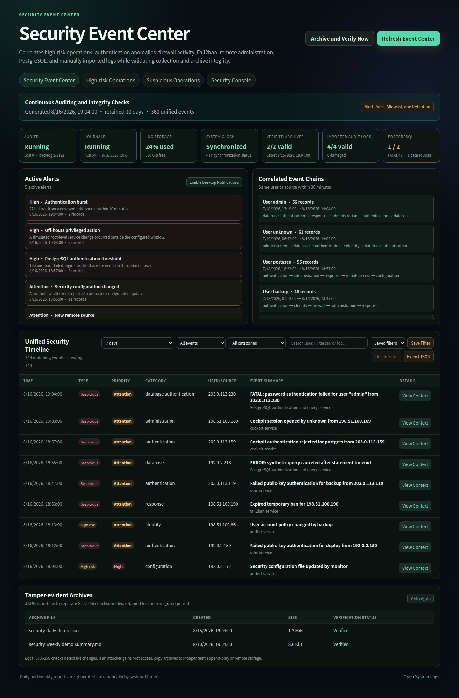

# Ubuntu Personal Server Security Console

A modular Cockpit security suite for Ubuntu personal servers. It brings log visibility, PostgreSQL authentication analytics, high-risk operation review, verified security archives, on-demand scanners, and per-key SSH controls into one browser-based console.

**[Open the live public demo](https://fullblackwolf.github.io/ubuntu-personal-server-security-console/)**

Demo credentials: `visitor` / `preview-only`. The preview is generated directly from the production Cockpit HTML, CSS, and JavaScript. Only Cockpit's host transport is replaced by a browser-local adapter backed by committed synthetic logs. The generated [source parity manifest](docs/app/source-manifest.json) records SHA-256 values for every production and preview asset.



## Why this project exists

Small self-hosted servers often have useful security data spread across journald, auditd, UFW, SSH, Fail2ban, PostgreSQL, and several command-line tools. This project presents those sources in Cockpit without introducing a separate database or an always-on analytics stack. Raw system logs remain local.

The Debian package contains a dependency-aware optional installer. Installing the package does not immediately enable every feature. The user chooses the desired components, sees a dependency dialog when a selection needs another component or Ubuntu package, and confirms all privileged changes.

## Features

- Unified event timeline across auditd, journald, SSH, UFW, Fail2ban, Cockpit, fwknop, XRDP, PostgreSQL, and imported historical logs.
- PostgreSQL authentication failures for 1 hour and 24 hours, multi-day hourly error-rate charts, recent FATAL logs, and top-100 failed users and source IPs.
- Universal historical log reader with gzip and UTF-8/GB18030 support, filtering, head/tail views, SHA-256 deduplication, and one-click managed audit import.
- Server-side review status, reviewer notes, saved filters, JSON/CSV export, event context, and actor/source correlation chains.
- Rule-based alerts, browser notifications, optional HTTPS webhooks, optional local sendmail delivery, and source/category allowlists.
- Configurable retention from 1 to 3,650 days; the default is 30 days.
- Daily and weekly JSON/Markdown archives with SHA-256 integrity files.
- On-demand AIDE, Lynis, debsums, and ClamAV controls. Heavy tasks stay disabled until explicitly requested.
- Per-key SSH source networks, expiry, session capabilities, and optional fwknop Single Packet Authorization checks.
- Fixed-action privileged controllers: browser input is never executed as an arbitrary shell command.

## Components

| Component | Purpose | Component dependency | Ubuntu package dependency |
| --- | --- | --- | --- |
| Security Dashboard | Host overview, maintenance actions, and universal historical log reader | None | None beyond the base package |
| PostgreSQL Security Analytics | Authentication and error statistics, FATAL logs, user/IP rankings | Security Dashboard | PostgreSQL is optional; logs are detected when present |
| Security Event Center | Timeline, reviews, alert rules, correlations, health, imports, and exports | Dashboard + PostgreSQL Analytics | `auditd` |
| Retention, Alerts, and Archives | Retention enforcement, five-minute alert checks, daily/weekly verified archives | Security Event Center | None |
| On-demand Security Scanners | AIDE, Lynis, debsums, and ClamAV controls | Security Dashboard | `aide`, `lynis`, `debsums`, `clamav` |
| SSH Key and SPA Manager | Per-key restrictions and fwknop SPA gating | Security Dashboard | `openssh-server`, `fwknop-server`, `iptables` |

See [Component architecture](docs/components.md) for data flow and privilege boundaries.

## Engineering architecture

The complete engineering specification is available in [ARCHITECTURE.md](ARCHITECTURE.md). It defines the system context, logical components, production and demo data paths, trust boundaries, privilege model, deployment topology, runtime flows, storage contracts, dependency graph, failure behavior, performance assumptions, and CI/release controls.

## Install on Ubuntu

Download the `.deb` from the latest GitHub release, verify its checksum, and install it:

```bash
sha256sum -c server-security-console_1.1.0_all.deb.sha256
sudo apt install ./server-security-console_1.1.0_all.deb
server-security-console-installer --gui
```

If no graphical session is available, the same command opens a terminal checklist through `whiptail`. You can also run:

```bash
sudo server-security-console-installer
```

The installer shows a dialog before adding required components. For example, selecting scheduled archives automatically requires the Event Center, PostgreSQL Analytics, and Dashboard. Missing Ubuntu packages are listed in a second confirmation dialog before `apt` is allowed to install them.

Open Cockpit at `https://SERVER_ADDRESS:9090/` after installation and refresh the navigation menu.

## Build the Debian package

```bash
./packaging/build-deb.sh
sha256sum -c dist/server-security-console_1.1.0_all.deb.sha256
```

The package is architecture-independent and targets currently supported Ubuntu LTS releases with Cockpit and Python 3.10 or newer.

## Security and privacy

- Imported logs are stored under `/var/lib/server-security-console/imported-logs/` with restrictive permissions and are never included in the source package.
- Review state and settings are written atomically under `/var/lib/server-security-console/`.
- Existing files replaced by the optional installer are backed up under `/var/backups/server-security-console-installer/`.
- Webhook and email delivery are disabled by default. Webhooks must use HTTPS and receive summaries rather than raw log bodies.
- Logs, archives, public/private keys, secrets, `.env` files, tokens, and build staging trees are excluded from Git.
- SHA-256 sidecars detect accidental or unprivileged archive changes. A root compromise can modify both an archive and its checksum, so copy important archives to independent append-only or remote storage.

Before publishing a fork, run the repository privacy checks documented in [SECURITY.md](SECURITY.md).

## Removal

Removing the Debian package disables its managed timers and removes components that were selected through the installer. Runtime logs, imported evidence, review records, archives, and backups are intentionally retained to prevent accidental evidence loss.

## License

MIT. See [LICENSE](LICENSE).
