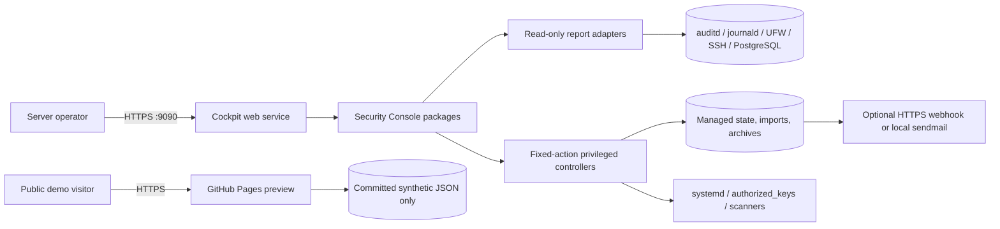
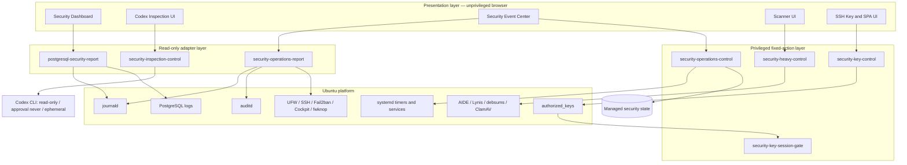
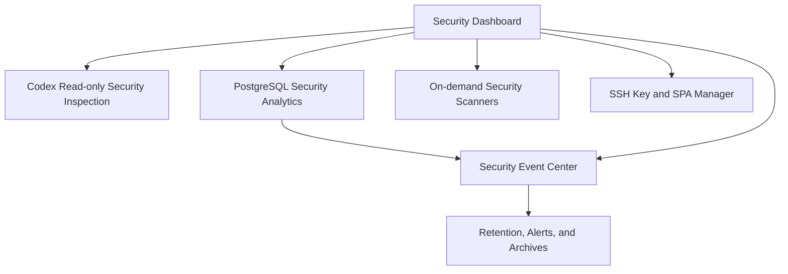

# Ubuntu Personal Server Security Console

A modular Cockpit security suite for Ubuntu personal servers. It brings log visibility, PostgreSQL authentication analytics, high-risk operation review, verified security archives, on-demand scanners, and per-key SSH controls into one browser-based console.

**[Open the live public demo](https://fullblackwolf.github.io/ubuntu-personal-server-security-console/)**

Demo credentials: `visitor` / `preview-only`. The preview is generated directly from the production Cockpit HTML, CSS, and JavaScript. Only Cockpit's host transport is replaced by a browser-local adapter backed by committed synthetic logs. The generated [source parity manifest](docs/app/source-manifest.json) records SHA-256 values for every production and preview asset.


## Why this project exists

Small self-hosted servers often have useful security data spread across journald, auditd, UFW, SSH, Fail2ban, PostgreSQL, and several command-line tools. This project presents those sources in Cockpit without introducing a separate database or an always-on analytics stack. Raw system logs remain local.

The Debian package contains a dependency-aware optional installer. Installing the package does not immediately enable every feature. The user chooses the desired components, sees a dependency dialog when a selection needs another component or Ubuntu package, and confirms all privileged changes.

## Features

- Unified event timeline across auditd, journald, SSH, UFW, Fail2ban, Cockpit, fwknop, XRDP, PostgreSQL, and imported historical logs.
- PostgreSQL authentication failures for 1 hour and 24 hours, multi-day hourly error-rate charts, recent FATAL logs, and top-100 failed users and source IPs.
- Universal historical log reader with gzip and UTF-8/GB18030 support, filtering, head/tail views, SHA-256 deduplication, and one-click managed audit import.
- Server-side review status, reviewer notes, saved filters, JSON/CSV export, event context, and actor/source correlation chains.
- Rule-based alerts, browser notifications, optional HTTPS webhooks, optional local sendmail delivery, and source/category allowlists.
- Configurable retention from 1 to 3,650 days; the default is 30 days.
- Daily and weekly JSON/Markdown archives with SHA-256 integrity files.
- On-demand AIDE, Lynis, debsums, and ClamAV controls. Heavy tasks stay disabled until explicitly requested.
- Per-key SSH source networks, expiry, session capabilities, and optional fwknop Single Packet Authorization checks.
- Fixed-action privileged controllers: browser input is never executed as an arbitrary shell command.

## Components

| Component | Purpose | Component dependency | Ubuntu package dependency |
| --- | --- | --- | --- |
| Security Dashboard | Host overview, maintenance actions, and universal historical log reader | None | None beyond the base package |
| PostgreSQL Security Analytics | Authentication and error statistics, FATAL logs, user/IP rankings | Security Dashboard | PostgreSQL is optional; logs are detected when present |
| Security Event Center | Timeline, reviews, alert rules, correlations, health, imports, and exports | Dashboard + PostgreSQL Analytics | `auditd` |
| Retention, Alerts, and Archives | Retention enforcement, five-minute alert checks, daily/weekly verified archives | Security Event Center | None |
| On-demand Security Scanners | AIDE, Lynis, debsums, and ClamAV controls | Security Dashboard | `aide`, `lynis`, `debsums`, `clamav` |
| SSH Key and SPA Manager | Per-key restrictions and fwknop SPA gating | Security Dashboard | `openssh-server`, `fwknop-server`, `iptables` |

See [Component architecture](docs/components.md) for data flow and privilege boundaries.

## Engineering architecture

### 1. Document purpose

This document defines the engineering architecture of Ubuntu Personal Server Security Console. It describes system boundaries, runtime components, data flows, privilege separation, deployment topology, reliability expectations, and the controls used to prevent public demo or build artifacts from crossing into production data paths.

The intended audience is maintainers, security reviewers, package engineers, and operators evaluating the system before deployment.

### 2. Architectural goals

The project is designed around the following goals:

1. **Local-first operation.** Security telemetry remains on the managed Ubuntu host unless an operator explicitly enables summary-only notification delivery.
2. **Low operational overhead.** The console uses existing host services and bounded report processes instead of adding a database, message broker, or resident analytics cluster.
3. **Explicit privilege boundaries.** Read-only collection and privileged mutation are separate programs. Privileged programs expose enumerated actions rather than arbitrary command execution.
4. **Modular deployment.** Operators select only the capabilities required by the host. The installer calculates transitive dependencies and asks before installing system packages.
5. **Evidence preservation.** Imported logs, review records, and archives use restrictive permissions, atomic state writes, SHA-256 metadata, and conservative uninstall behavior.
6. **Degraded-mode visibility.** Missing optional sources produce health information rather than making the entire interface unavailable.
7. **Safe public demonstration.** The GitHub Pages preview is isolated from all production code paths and reads only a committed, deterministic synthetic dataset.

### 3. Non-goals

- It is not a multi-tenant SIEM or a replacement for centralized enterprise log management.
- It does not claim tamper resistance against a fully compromised root account.
- It does not expose arbitrary shell execution from the browser.
- It does not upload raw logs to the public preview, GitHub, webhooks, or email recipients.
- It does not automatically enable high-resource scanners during package installation.

### 4. System context



The production console executes inside Cockpit's authenticated host session. GitHub Pages is a separate static deployment and has no route, credential, token, or API endpoint connected to the Ubuntu host.

### 5. Logical architecture

The production system follows a presentation–adapter–controller architecture.



#### 5.1 Presentation layer

Cockpit packages under `/usr/share/cockpit/` provide HTML, CSS, and JavaScript. They render reports, validate user input before submission, and call only known local executables through Cockpit. The browser does not directly read privileged files.

#### 5.2 Read-only adapter layer

Report adapters normalize heterogeneous host sources into versioned JSON documents:

- `postgresql-security-report` reads PostgreSQL journal and supported text, CSV, JSON, JSONL, and gzip log formats. It calculates authentication counts, hourly errors per minute, FATAL records, and failed-login rankings.
- `security-operations-report` reads known audit and service sources, redacts secret-shaped fields, incorporates integrity-verified imported logs, assigns categories and severities, evaluates rule conditions, and builds bounded actor/source correlations.
- `security-inspection-control` exposes only `status`, `run`, and `save-log`. The run action supplies a compiled-in prompt to `codex exec`; browser input cannot replace it. Codex is forced into a read-only sandbox with approval escalation disabled and ephemeral session storage. The same Chinese report-only boundary—reports only, no real operations, and no operational authority—is repeated in the page, terminal banner, prompt preamble, prompt conclusion, and saved-log header.

Adapters use fixed command paths, bounded input sizes, timeouts, and output limits. They do not mutate host state.

#### 5.3 Privileged controller layer

Controllers are the only production components allowed to mutate protected state:

- `security-operations-control` accepts review, configuration, saved-filter, log-import, archive, verification, retention, and notification actions.
- `security-heavy-control` accepts a fixed scanner task and fixed service action vocabulary.
- `security-key-control` validates requested SSH key policy, backs up the current file, and atomically updates `authorized_keys`.
- `security-key-session-gate` and `security-key-knock-check` enforce the bounded SPA policy associated with a managed key.

No controller evaluates browser-provided shell text. Component IDs, action names, paths, retention bounds, URLs, addresses, and key material are validated against action-specific rules.

### 6. Component model and dependencies



| Component | Installed assets | Internal dependencies | Required Ubuntu packages |
| --- | --- | --- | --- |
| Security Dashboard | Cockpit dashboard package | None | Base package dependencies |
| Codex Read-only Security Inspection | Cockpit inspection package and fixed-action user helper | Dashboard | Codex CLI installed and authenticated for the Cockpit user |
| PostgreSQL Security Analytics | PostgreSQL report adapter | Dashboard | None; PostgreSQL sources are detected when present |
| Security Event Center | Cockpit operations package, report adapter, controller | Dashboard, PostgreSQL Analytics | `auditd` |
| Retention, Alerts, and Archives | systemd units and journald policy | Event Center | None beyond parent dependencies |
| On-demand Security Scanners | Cockpit scanner package and controller | Dashboard | `aide`, `lynis`, `debsums`, `clamav` |
| SSH Key and SPA Manager | Cockpit key package, key controller, forced-command gate | Dashboard | `openssh-server`, `fwknop-server`, `iptables` |

The installer computes the full dependency closure before applying a selection. Internal component additions and missing Ubuntu packages use separate confirmation dialogs.

### 7. Primary runtime flows

#### 7.1 Report query

1. An authenticated Cockpit user opens a page or requests refresh.
2. The page invokes a known report adapter.
3. The adapter reads only configured system sources within retention and row limits.
4. Messages pass through source normalization and secret redaction.
5. The adapter emits JSON to stdout.
6. The page renders the result without persisting it in browser storage, except non-sensitive UI preferences where applicable.

#### 7.2 Codex security inspection

1. The authenticated Cockpit user opens the Inspection page and optionally selects transcript saving, which is off by default.
2. The Start action calls the user-scoped helper with the literal `run` action; no prompt text or command is accepted from the browser.
3. The helper invokes `codex exec` with a compiled-in report request, read-only sandbox, `approval never`, ignored user configuration, and an ephemeral session.
4. Codex may perform only read-only inspection and streams its textual report into the embedded terminal view. Closing the page or selecting Stop terminates the child process.
5. If and only if saving was selected before launch, the completed transcript is sent to the literal `save-log` action and written beneath the current user's private state directory with restrictive permissions.

#### 7.3 Historical log import

1. The user selects a local file in the browser.
2. Browser-side code enforces the supported decompressed size limit and displays a local preview.
3. An explicit one-click import sends the decoded content to the fixed `import-log` action.
4. The controller calculates SHA-256, rejects duplicate content, assigns a generated ID, and writes the file with mode `0600` inside a mode `0700` directory.
5. Import metadata and an audit change record are written atomically.
6. The report adapter verifies the stored checksum before incorporating imported records into the unified timeline.
7. Retention enforcement removes expired imports according to the configured policy.

#### 7.4 Review state change

1. The operator selects a normalized event and submits an allowed status plus bounded note.
2. The controller records reviewer identity, timestamp, status, note, and an event snapshot.
3. State is replaced atomically under a file lock.
4. A JSON Lines audit entry records before/after values.
5. Subsequent report requests join review state back onto normalized events.

#### 7.5 Scheduled archive

1. A daily or weekly systemd timer invokes the archive action.
2. The controller requests high-risk, suspicious, unified, and PostgreSQL reports using fixed executable paths.
3. The result and review state are written to a mode `0400` JSON archive.
4. A concise Markdown summary is created.
5. Each file receives a SHA-256 sidecar.
6. Archive verification recalculates hashes and exposes invalid results to health reporting.

#### 7.6 Alert notification

1. The five-minute timer evaluates the current unified report.
2. Alert IDs are compared with the bounded delivery history.
3. Disabled channels cause no external traffic.
4. An enabled HTTPS webhook or local sendmail channel receives only the alert summary.
5. Successful delivery IDs are saved to avoid repeated notifications.

### 8. Data architecture

#### 8.1 Production storage

| Path | Owner/mode intent | Content |
| --- | --- | --- |
| `/var/lib/server-security-console/operations-state.json` | root, `0600` | Review state, alert settings, allowlists, import metadata, notification state |
| `/var/lib/server-security-console/review-audit.jsonl` | root, `0600` | Append-oriented control change records |
| `/var/lib/server-security-console/imported-logs/` | root, directory `0700`, files `0600` | Managed historical log content |
| `/var/lib/server-security-console/archives/` | root, directory `0700`, reports `0400` | JSON/Markdown reports and SHA-256 sidecars |
| `/var/lib/server-security-console-installer/state.json` | root, `0644` in `0755` directory | Non-sensitive selected component IDs for the unprivileged selector |
| `/var/backups/server-security-console-installer/` | root, `0700` | Files replaced or removed during component changes |
| `~/.local/state/server-security-console/inspection-logs/` | Cockpit user, directory `0700`, files `0600` | Opt-in Codex inspection transcripts only |

State files use temporary files, `fsync`, permission assignment, and atomic rename. Controller updates use a lock to serialize concurrent writes.

#### 8.2 Synthetic preview storage

`docs/demo-data.json` is a deterministic static dataset generated by `tools/generate-demo-data.py`. It contains only fictional identities, the reserved hostname suffix `example.invalid`, and RFC 5737 documentation address blocks. The public site fetches this file from the same GitHub Pages origin.

`tools/build-demo-site.py` copies the production Cockpit HTML, CSS, and JavaScript into `docs/app/`. CSS and application JavaScript remain byte-identical. In HTML files, the single Cockpit transport script reference is changed from `../base1/cockpit.js` to `../cockpit-demo.js`; no layout or application logic is rewritten. A generated SHA-256 source manifest makes this relationship reviewable and CI tests enforce it.

The preview credential is intentionally public and checked in browser JavaScript. It is a demonstration gate, not authentication, and has no production equivalent or server-side authority.

### 9. Security architecture

#### 9.1 Trust boundaries

| Boundary | Untrusted side | Trusted side | Control |
| --- | --- | --- | --- |
| Browser to Cockpit | Page input | Authenticated Cockpit transport | Cockpit session, fixed executable invocation, structured validation |
| Report to host logs | Heterogeneous log text | Normalized event model | Bounded reads, parser isolation, redaction, output limits |
| Import to managed evidence | User-selected text | Integrity-tracked file | Size limit, safe generated path, SHA-256 deduplication, restrictive modes |
| Controller to protected host state | Structured browser request | Root filesystem/services | Enumerated actions, fixed paths, atomic backup/write, polkit/Cockpit escalation |
| Notification to external endpoint | Alert summary | HTTPS endpoint or local MTA | Disabled by default, HTTPS-only webhook validation, no raw log body |
| GitHub Pages to production | Public visitor | None | Architectural isolation; static same-origin files only; CSP denies external connections |

#### 9.2 Sensitive-data controls

- Secret-shaped assignments and credential-bearing URLs are redacted during normalization.
- Public-key management accepts public keys only and rejects private-key content.
- Repository ignore rules exclude common logs, key files, tokens, `.env` files, archives, imports, and build staging trees.
- Release validation scans both the Git tree and extracted Debian payload for personal paths, key headers, token patterns, runtime directories, and sensitive file extensions.
- Documentation uses only reserved example networks and domains.

#### 9.3 Integrity limitations

SHA-256 sidecars detect accidental changes and changes by actors unable to replace both files. They are not a cryptographic root of trust against a root-level attacker. Operators requiring stronger assurance should export archives to append-only, signed, or remote storage.

### 10. Deployment architecture

```mermaid
flowchart LR
    Deb[server-security-console .deb] --> Payload[/usr/share/server-security-console/payload]
    Deb --> Selector[/usr/sbin/server-security-console-installer]
    Selector -->|selected UI assets| CockpitDir[/usr/share/cockpit]
    Selector -->|fixed executables| LocalBin[/usr/local/libexec and /usr/local/sbin]
    Selector -->|optional units| Units[/etc/systemd/system]
    Selector -->|backup before replace| Backups[/var/backups]
    Workflow[GitHub Actions] --> Deb
    Workflow --> Artifact[CI package artifact]
    Release[GitHub Release] --> Deb
    Pages[GitHub Pages] --> Demo[docs static preview]
```

The base Debian installation deploys only the selector, metadata, documentation, and inert component payload. It does not copy Cockpit modules, enable timers, alter SSH, or select features. Component application requires a second explicit confirmation and administrator authorization.

Removing the Debian package disables managed timers and removes files tracked by the component state. Runtime evidence, imports, reviews, archives, and backups remain to prevent accidental evidence destruction.

### 11. Availability and failure behavior

- A missing optional log source is represented as unavailable or empty; unrelated pages continue operating.
- Report subprocesses have timeouts and bounded output so a stalled source cannot block indefinitely.
- A failed notification does not stop local alert evaluation or auditing.
- A failed archive source prevents an incomplete archive from being reported as successful.
- Duplicate imports return existing metadata and do not create a second evidence copy.
- Invalid archive or import hashes are surfaced through health status and the affected imported content is excluded from trusted processing.
- Scheduled tasks use `oneshot` systemd services with randomized timer delay to minimize simultaneous disk load.

### 12. Performance and scale assumptions

The target is a personal or small self-hosted Ubuntu server. Collection is query-time and bounded rather than continuously indexed. Charts aggregate hourly values, rendered tables apply row caps, imported files have a decompressed size limit, and scanner tasks are on demand. Hosts with enterprise-scale event volume should forward data to a dedicated SIEM and treat this console as a local operational view.

### 13. Test and release architecture

The repository CI pipeline performs:

1. Python compilation for controllers, reports, and installer.
2. JavaScript syntax validation for Cockpit and demo code.
3. POSIX shell validation for package and legacy installation scripts.
4. JSON validation for component metadata and synthetic demo data.
5. Installer unit tests covering dependency closure, unknown-component rejection, target path confinement, and file modes.
6. Debian package construction and artifact upload.

Release preparation additionally performs source and extracted-payload privacy scans, local checksum verification, a real base-package install, and remote GitHub visibility/asset verification.

### 14. Repository layout

```text
.
├── security_dashboard/       # Cockpit overview and historical log UI
├── security_inspection/      # Fixed-prompt Codex inspection UI
├── security_operations/      # Event Center and risk review UI
├── security_heavy/           # On-demand scanner UI
├── security_keys/            # SSH key and SPA UI
├── packaging/                # Debian builder, metadata, installer, maintainer scripts
├── docs/                     # Architecture visuals and GitHub Pages public demo
├── tools/                    # Deterministic synthetic dataset generator
├── tests/                    # Installer dependency and target-safety tests
├── *-report                  # Read-only normalized report adapters
├── security-inspection-control # User-scoped fixed-prompt Codex launcher
├── *-control                 # Fixed-action privileged controllers
└── *.service / *.timer       # Optional automation units
```

### 15. Architectural decision summary

| Decision | Rationale | Trade-off |
| --- | --- | --- |
| Cockpit as the presentation host | Reuses Ubuntu authentication, transport, and administration context | Requires Cockpit |
| Local JSON state instead of a database | Minimal dependencies and simple backup/inspection | Not intended for multi-host analytical scale |
| Query-time normalization | No resident indexing service or duplicated log store | Large source volumes require strict bounds |
| Fixed-action root controllers | Reduces command-injection and privilege surface | New privileged operations require code changes |
| Dependency-aware optional package | Avoids enabling unwanted high-resource or SSH features | Installation is a two-stage process |
| Static synthetic GitHub Pages demo | Publicly reviewable without exposing a server | Demo login is illustrative rather than real authentication |
| SHA-256 archive sidecars | Simple integrity visibility and portability | Does not resist a root attacker without external trust |

## Install on Ubuntu

Download the `.deb` from the latest GitHub release, verify its checksum, and install it:

```bash
sha256sum -c server-security-console_1.1.0_all.deb.sha256
sudo apt install ./server-security-console_1.1.0_all.deb
server-security-console-installer --gui
```

If no graphical session is available, the same command opens a terminal checklist through `whiptail`. You can also run:

```bash
sudo server-security-console-installer
```

The installer shows a dialog before adding required components. For example, selecting scheduled archives automatically requires the Event Center, PostgreSQL Analytics, and Dashboard. Missing Ubuntu packages are listed in a second confirmation dialog before `apt` is allowed to install them.

Open Cockpit at `https://SERVER_ADDRESS:9090/` after installation and refresh the navigation menu.

## Build the Debian package

```bash
./packaging/build-deb.sh
sha256sum -c dist/server-security-console_1.1.0_all.deb.sha256
```

The package is architecture-independent and targets currently supported Ubuntu LTS releases with Cockpit and Python 3.10 or newer.

## Security and privacy

- Imported logs are stored under `/var/lib/server-security-console/imported-logs/` with restrictive permissions and are never included in the source package.
- Review state and settings are written atomically under `/var/lib/server-security-console/`.
- Existing files replaced by the optional installer are backed up under `/var/backups/server-security-console-installer/`.
- Webhook and email delivery are disabled by default. Webhooks must use HTTPS and receive summaries rather than raw log bodies.
- Logs, archives, public/private keys, secrets, `.env` files, tokens, and build staging trees are excluded from Git.
- SHA-256 sidecars detect accidental or unprivileged archive changes. A root compromise can modify both an archive and its checksum, so copy important archives to independent append-only or remote storage.

Before publishing a fork, run the repository privacy checks documented in [SECURITY.md](SECURITY.md).

## Removal

Removing the Debian package disables its managed timers and removes components that were selected through the installer. Runtime logs, imported evidence, review records, archives, and backups are intentionally retained to prevent accidental evidence loss.

## License

MIT. See [LICENSE](LICENSE).
